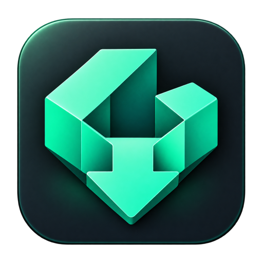
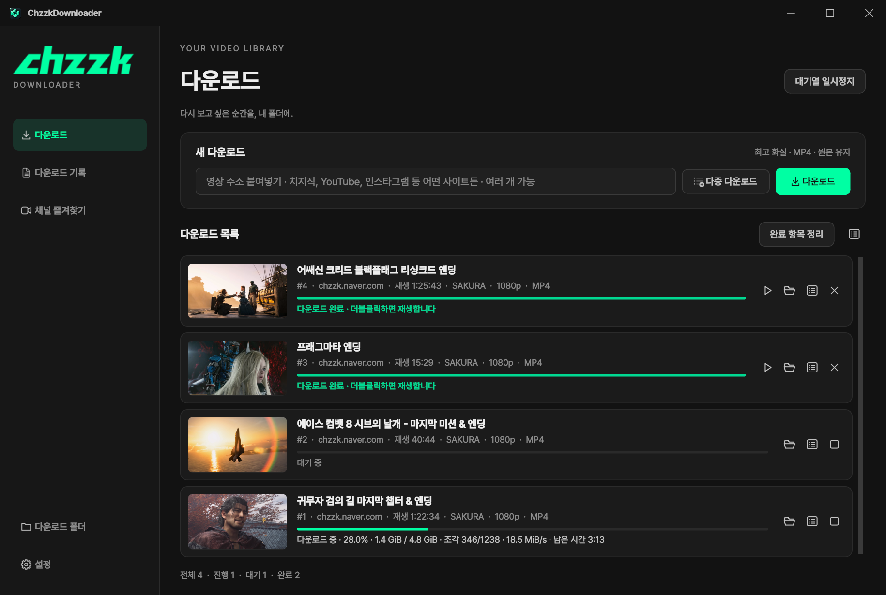

<h1 align="center"> 치지직 다운로더 (ChzzkDownloader)</h1>

  
  
  
  
  
  

  
  

---

  
  
  
  
  
  
  

---

## 📌 간단 소개

치지직 VOD와 클립을 MP4로 저장하는 Windows 프로그램입니다. 주소를 붙여넣거나, 즐겨찾는 채널에서 영상을 골라 받습니다. 유투브 영상을 비롯 yt-dlp가 지원하는 기타 영상도 받을 수 있습니다.

## 💻 시스템 요구 사항

- Windows 10 / 11 (x64)
- 인터넷 연결

## ✨ 주요 기능

- **다운로드**: 주소 붙여넣기·끌어놓기, ‘다중 다운로드’ 창에서 여러 주소를 한 줄씩 추가. 동시 영상 최대 4개·영상당 조각 최대 16개
- **저장 설정**: 설정 화면에서 저장 위치·최고 화질 또는 해상도 상한·인코딩을 선택하고 다음 실행에도 유지
- **완료 항목**: 이번 실행에서 완료한 영상은 다운로드 목록에서 재생하거나 더블클릭. ‘완료 항목 정리’로 숨겨도 기록과 영상은 유지
- **채널 즐겨찾기**: 채널명이나 주소로 검색해 저장하고, 채널 VOD를 썸네일·제목·날짜 카드로 보며 골라 받기
- **다운로드 기록**: 완료·실패·취소 작업을 따로 모아 다시 재생·재시도. 썸네일은 다시 열어도 유지
- **MP4 저장·변환**: 원본 유지가 기본. 필요하면 CPU 또는 NVIDIA NVENC로 H.264(AVC)·H.265(HEVC) 변환. 변환이 실패하거나 취소돼도 원본 보존
- **트레이 실행**: 창을 닫아도 트레이에서 다운로드 계속, 대기열 일시정지·재개, 완료 알림
- **자동 업데이트**: GitHub 정식 릴리스의 추가·변경·수정 내역을 확인한 뒤 ‘지금 업데이트’·‘나중에’를 선택. 설치 시 SHA-256 검증 후 프로그램만 교체. 영상·기록·설정은 그대로
- **도구 업데이트**: 없는 FFmpeg·ffprobe는 첫 실행에 자동으로 준비. 설정의 ‘도구 업데이트’로 최신 FFmpeg와 yt-dlp nightly를 받고 다음 다운로드부터 적용

## 🚀 사용 방법

1. 릴리스의 `ChzzkDownloader_v100.zip`(버전 1.0.0 기준)을 풀고 `ChzzkDownloader.exe`를 실행합니다. `lib`, `bin` 폴더는 EXE 옆에 그대로 둡니다.
2. 첫 실행에는 인터넷으로 필요한 영상 도구를 자동으로 받습니다. 준비가 끝나면 사이드바 맨 아래 **설정**에서 저장 위치·화질·인코딩·동시 다운로드 수를 정합니다. 도구를 최신으로 바꾸려면 작업이 끝난 뒤 **도구 업데이트**를 누릅니다.
3. 어떤 사이트의 영상 주소든 붙여넣고 **다운로드**를 누릅니다. 여러 영상은 **다중 다운로드** 창에 한 줄씩 넣고 **다운로드 (개수)**를 누릅니다. 입력 순서대로 목록에 추가되며 설정한 동시 영상 수만큼 시작합니다.
4. 채널 단위로 고르려면 **채널 즐겨찾기**에서 채널을 저장한 뒤 카드를 눌러 영상을 선택합니다.
5. 이번 실행의 완료 영상은 **다운로드 목록**에서 바로 재생합니다. **완료 항목 정리**는 이 목록에서만 숨기며, 이전 실행의 작업·실패·취소 항목은 **다운로드 기록**에서 확인합니다.

## ⚠ 주의 사항

- 공개 영상만 받을 수 있습니다. 연령 확인·구독자 전용 영상은 지원하지 않습니다.
- 받은 영상은 개인 소장 용도로만 사용하고, 저작권과 플랫폼 이용 약관을 지켜 주세요.
- NAVER·치지직의 공식 프로그램이 아닙니다.

## 💾 백업할 파일

EXE 옆의 `settings.json`(설정), `history.json`(다운로드 기록), `favorites.json`(채널 즐겨찾기)을 백업하세요. `thumbnail-cache\`는 지워도 다시 만들어집니다. 업데이트는 이 파일들을 바꾸지 않습니다.

## 📜 라이선스

본 저장소는 **ChzzkDownloader의 배포 및 소개를 위한 공간**입니다. 프로젝트 자체 소스 코드는 공개하지 않으며, 프로그램과 자체 제작 자료에는 [프로젝트 이용 조건](LICENSE)이 적용됩니다.

- **개인 이용**: 개인의 비상업적 용도로 사용할 수 있습니다.
- **상업적 이용 금지**: 제작자의 사전 허락 없이 판매·유료 서비스 제공 등 영리 목적으로 이용할 수 없습니다.
- **무단 재배포 금지**: 제작자의 사전 허락 없이 프로그램·배포 파일·자체 제작 자료를 재업로드하거나, 수정한 버전을 배포할 수 없습니다. 소개할 때는 공식 홈페이지나 릴리스 링크를 공유해 주세요.

포함된 FFmpeg·yt-dlp·PySide6·Pretendard·아이콘(Fluent UI System Icons, Octicons) 등 외부 구성요소에는 각각의 라이선스가 적용되며, 위 제한은 해당 라이선스가 부여하는 권리를 제한하지 않습니다.
