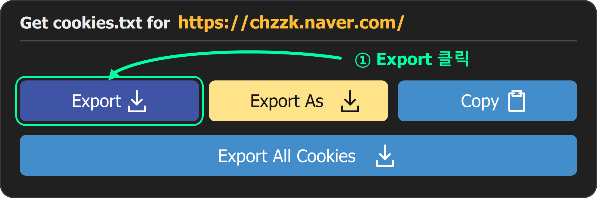
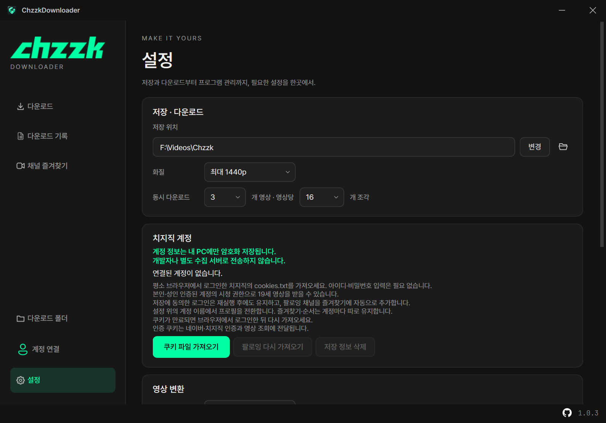
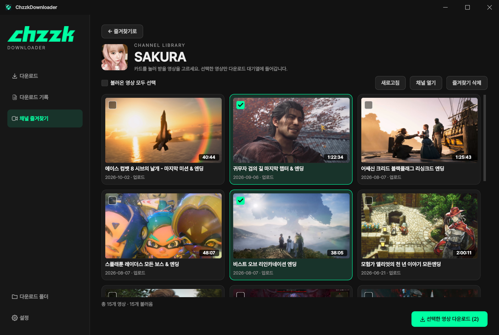
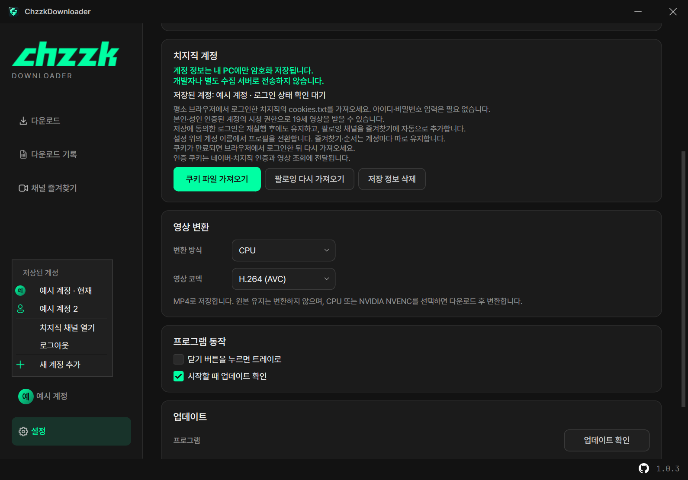
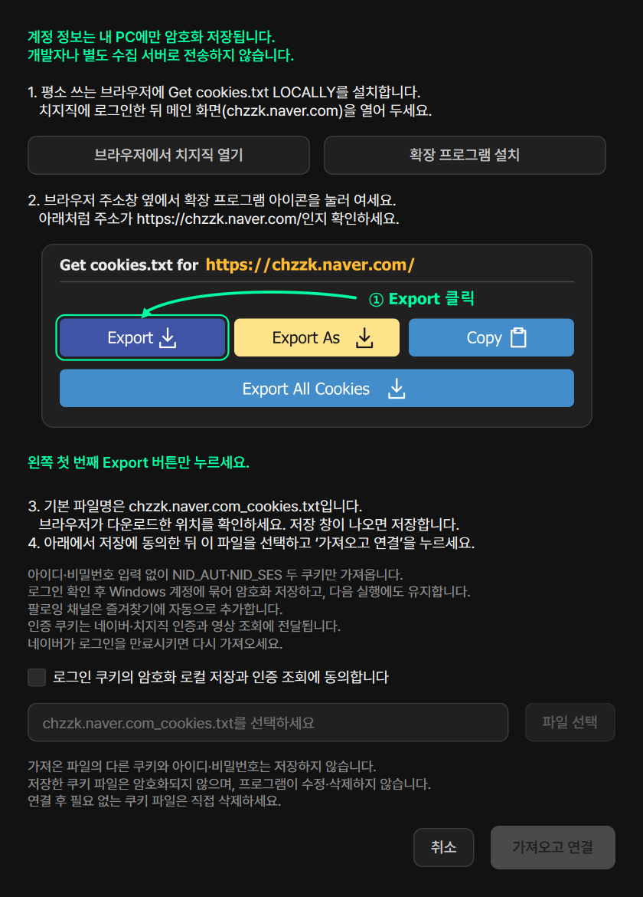
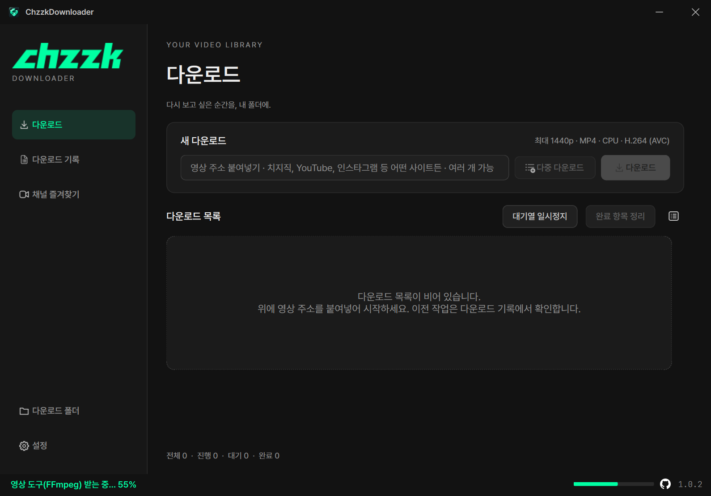
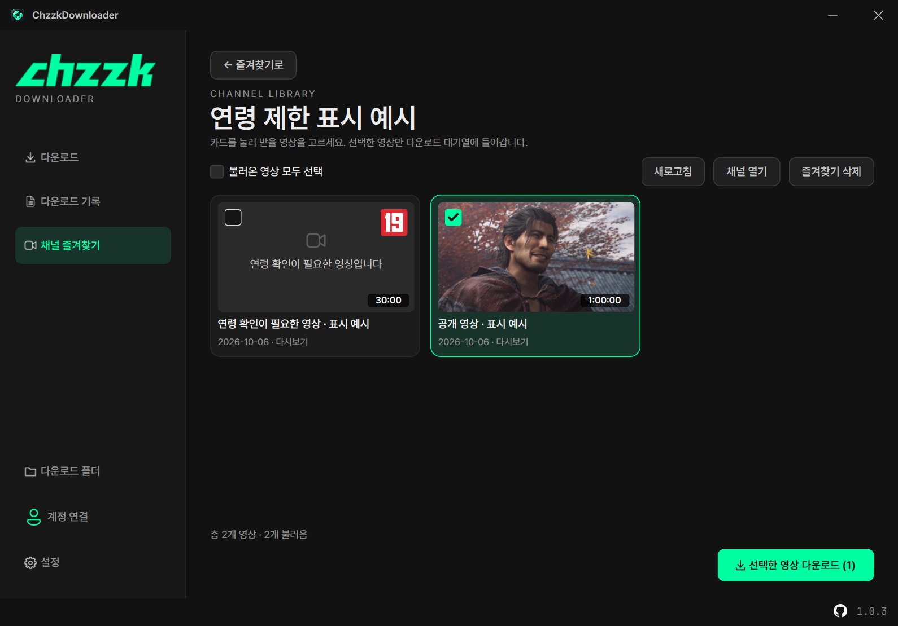

<h1 align="center"> 치지직 다운로더 (ChzzkDownloader)</h1>

  
  
  
  
  
  

  
  

---

  
  
  
  
  
  
  
  

---

## 📌 간단 소개

치지직 VOD·클립, YouTube, 인스타그램, TVer 등 여러 사이트의 영상 주소를 분석해 MP4로 저장하는 Windows 프로그램입니다.
주소를 붙여넣거나, 즐겨찾는 치지직 채널에서 영상을 골라 받습니다.
평소 브라우저에서 내보낸 쿠키로 치지직 계정을 연결하면 팔로잉 채널을 즐겨찾기로 가져오고, 시청 권한이 있는 19세 영상도 받을 수 있습니다.
TVer는 일본 VPN에 연결한 상태에서 다운로드해야 합니다.

## 💻 시스템 요구 사항

- Windows 10 / 11 (x64)
- 인터넷 연결

## ✨ 주요 기능

- **다운로드**: 주소 붙여넣기·끌어놓기, ‘다중 다운로드’ 창에서 여러 주소를 한 줄씩 추가. 동시 영상 최대 4개·영상당 조각 최대 16개
- **저장 설정**: 설정 화면에서 저장 위치·최고 화질 또는 해상도 상한·인코딩을 선택하고 다음 실행에도 유지
- **완료 항목**: 이번 실행에서 완료한 영상은 다운로드 목록에서 재생하거나 더블클릭. ‘완료 항목 정리’로 숨겨도 기록과 영상은 유지
- **대기 목록 복원·삭제**: 취소·대기·종료 중단 작업은 다시 실행하면 대기 상태로 복원. ‘대기열 계속’으로 시작하며, 필요 없는 대기 항목은 다운로드 목록에서 우클릭 → ‘목록에서 삭제’로 복원 없이 제거
- **중복 다운로드 확인**: 완료 기록과 같은 영상 주소를 다시 넣으면 다시 다운로드할지 확인
- **채널 즐겨찾기**: 채널명이나 주소로 검색해 저장하고, 저장한 카드를 드래그해 순서 변경. 채널 VOD를 썸네일·제목·날짜 카드로 보며 골라 받기. 연령 제한 영상은 썸네일 오른쪽 위의 19세 배지로 구분
- **치지직 계정 연결**: 평소 브라우저에서 내보낸 cookies.txt로 연결. 아이디·비밀번호 입력 없이 로그인 쿠키만 Windows 암호화로 보관하며 다시 실행해도 유지. 본인·성인 인증된 계정의 시청 권한으로 19세 영상 다운로드
- **팔로잉 자동 추가**: 저장된 계정의 팔로잉 채널을 로그인·앱 시작 시 즐겨찾기에 자동 추가. 기존 채널과 순서를 유지하고 중복 없이 병합하며, 설정에서 다시 가져오기 가능
- **계정 프로필 전환**: 여러 계정의 쿠키를 저장하고 설정 위의 프로필 사진·계정 이름에서 전환. 계정마다 즐겨찾기와 순서를 따로 유지
- **다운로드 기록**: 완료·실패·취소 작업을 따로 모아 다시 재생·재시도. 썸네일은 다시 열어도 유지
- **작업 로그**: 목록 상단의 로그 버튼으로 열고 닫기. 카드 선택이나 로그 필터로 원하는 작업만 확인하며 로그를 열어도 입력창·버튼·카드가 좌우로 밀리지 않음
- **MP4 저장·변환**: 원본 유지가 기본. 필요하면 CPU 또는 NVIDIA NVENC로 H.264(AVC)·H.265(HEVC) 변환. 변환이 실패하거나 취소돼도 원본 보존
- **트레이 실행**: 창을 닫아도 트레이에서 다운로드 계속, 대기열 일시정지·재개, 완료 알림
- **자동 업데이트**: GitHub 정식 릴리스의 추가·변경·수정 내역을 확인한 뒤 ‘지금 업데이트’·‘나중에’를 선택. 설치 시 SHA-256 검증 후 프로그램만 교체. 영상·기록·설정은 그대로. 설정에서 직접 확인했을 때 최신이면 안내창 표시
- **도구 업데이트**: 첫 실행에 FFmpeg·ffprobe와 yt-dlp nightly를 받고, 시작할 때마다 확인해 없거나 손상되었으면 자동으로 다시 준비. 모든 탭의 하단에서 상태·진행률을 확인하고, 완료 안내는 5초 뒤 서서히 사라짐. 설정의 ‘도구 업데이트’는 최신 도구를 다시 받지 않고 바뀌었거나 손상된 도구만 교체
- **화면과 버전 표시**: 화면 해상도와 Windows 배율에 맞춘 고정 창. 진행률·속도·버전에는 JetBrains Mono를 적용하고, 메인 창 오른쪽 아래의 흰색 GitHub 아이콘을 누르면 저장소로 이동

## 🚀 사용 방법

1. 릴리스의 `.zip` 파일을 다운받아 압축을 풀고 `ChzzkDownloader.exe`를 실행합니다.
2. 첫 실행에는 인터넷으로 필요한 영상 도구(FFmpeg·ffprobe, yt-dlp nightly)를 자동으로 받습니다. **창 하단의 상태와 진행 표시**로 준비 상황을 확인하세요. 준비가 끝나면 사이드바 맨 아래 **설정**에서 저장·다운로드, 치지직 계정, 영상 변환, 프로그램 동작, 업데이트 항목을 정합니다.
3. 어떤 사이트의 영상 주소든 붙여넣고 **다운로드**를 누릅니다. 여러 영상을 한꺼번에 추가하고 싶을 경우 **다중 다운로드** 창에 한 줄씩 넣고 **다운로드 (개수)**를 누릅니다. 입력 순서대로 목록에 추가되며 설정한 동시 영상 수만큼 시작합니다.
4. 채널 단위로 고르려면 **채널 즐겨찾기**에서 채널을 검색 저장한 뒤 카드를 눌러 영상을 선택합니다. 
5. 다운이 완료된 영상은 **다운로드 목록**에서 바로 재생 가능합니다. 이전 실행의 작업·실패·취소 항목은 **다운로드 기록**에서 확인합니다.
6. 취소·대기·종료 중단 작업은 다음 실행에 대기로 복원됩니다. **대기열 계속**으로 재개하세요. 필요 없는 대기 항목은 **다운로드 목록에서 우클릭 → 목록에서 삭제**를 누릅니다. 삭제한 항목은 다시 대기로 복원하지 않고, 기록과 영상 파일은 유지합니다. 완료 기록과 같은 영상을 다시 추가하면 **다시 다운로드**할지 확인합니다.
7. 치지직 계정을 연결하려면 아래 **쿠키 파일 저장하기**를 따라 `chzzk.naver.com_cookies.txt`를 저장합니다. 앱의 **설정 → 치지직 계정 → 쿠키 파일 가져오기**에서 저장에 동의하고 이 파일을 선택한 뒤 **가져오고 연결**을 누릅니다. 로그인 확인 후 인증 쿠키 두 개만 암호화 저장하고 팔로잉 채널을 즐겨찾기에 추가합니다. 아이디·비밀번호 입력은 필요 없습니다.
8. 다른 계정의 쿠키를 가져오면 새 프로필로 추가하고, 같은 계정은 쿠키를 갱신합니다. **설정 위의 프로필 사진·계정 이름**을 누르면 저장된 계정을 전환하고 **치지직 채널 열기·로그아웃·새 계정 추가**를 선택할 수 있습니다. 계정이 하나여도 같은 메뉴를 표시하며, **새 계정 추가**를 누르면 **브라우저 쿠키로 치지직 계정 연결** 창이 바로 열립니다. 저장에 동의한 뒤 다른 계정의 쿠키 파일을 선택해 연결하세요. 즐겨찾기와 순서는 계정마다 따로 보관하고 재실행해도 선택한 계정을 유지합니다. 사진이 없는 계정에는 기본 아이콘을 표시합니다.

### 쿠키 파일 저장하기

1. 평소 브라우저에 [Get cookies.txt LOCALLY](https://chromewebstore.google.com/detail/get-cookiestxt-locally/cclelndahbckbenkjhflpdbgdldlbecc)를 설치합니다.
2. 치지직에 로그인한 뒤 `메인 화면 https://chzzk.naver.com/` 을 열어 둡니다.
3. **브라우저 주소창 옆에서 확장 프로그램 아이콘을 눌러** 여세요. 아래처럼 표시된 주소가 치지직인지 확인한 뒤 **왼쪽 첫 번째 Export 버튼만** 누르세요.

4. 기본 파일명은 `chzzk.naver.com_cookies.txt`입니다. 브라우저의 다운로드 위치를 확인하고, 저장 창이 나오면 원하는 위치에 저장합니다.
5. 앱에서 **쿠키 파일 가져오기 → 저장 동의 → 파일 선택 → 가져오고 연결** 순서로 진행합니다. 가져오기 창에서도 같은 이미지와 순서를 확인할 수 있습니다.

### 화면 살펴보기

아래 화면은 1.0.3 배포본에서 캡처한 실제 화면입니다. 영상·진행 상태와 계정 이름·사진은 소개용 예시입니다.

| 설정 | 채널 영상 |
| --- | --- |
|  |  |

| 계정 전환 | 쿠키로 계정 연결 |
| --- | --- |
|  |  |

| 도구 준비 | 연령 제한 표시 |
| --- | --- |
|  |  |

## ⚠ 주의 사항

- 19세 영상은 본인·성인 인증된 네이버 계정으로 로그인해야 하며, 구독자 영상 등은 해당 계정의 시청 권한이 필요합니다. 인증·권한이 없는 영상은 받을 수 없습니다.
- **가져온 로그인 쿠키는 내 PC에만 암호화 저장하며, 개발자나 별도 수집 서버로 전송하지 않습니다.** 인증 쿠키는 네이버·치지직 인증과 영상 조회에 전달됩니다. 앱에서는 아이디·비밀번호를 입력받거나 저장하지 않습니다.
- 로그인 저장은 선택 사항입니다. 동의 후 가져온 로그인 쿠키는 EXE 옆 `.auth`에 Windows 사용자 계정에 묶여 암호화 저장됩니다. 앱 재실행 후에도 저장은 유지되지만 쿠키 만료나 네이버의 로그인 해제 시 다시 가져와야 하며, 영구 로그인을 보장하지 않습니다. 설정의 **저장 정보 삭제**로 지울 수 있습니다.
- **로그아웃·저장 정보 삭제**는 현재 계정의 쿠키만 지웁니다. 다른 저장 계정이 있으면 그 계정으로 전환하며, 즐겨찾기·영상은 유지합니다. 첫 연결 계정은 기존 공용 즐겨찾기를 이어받고, 이후 계정은 별도 목록을 사용합니다.
- 쿠키 파일 가져오기는 `NID_AUT`·`NID_SES`만 저장하며, 파일의 다른 쿠키와 경로는 저장하지 않습니다. 저장한 쿠키 파일은 암호화되지 않고 프로그램이 수정·삭제하지 않으므로 연결 후 필요 없는 쿠키 파일은 직접 삭제하세요.
- TVer 영상은 일본 VPN에 연결한 뒤 받아야 하며, 다운이 끝날 때까지 VPN 연결을 유지해야 합니다.
- 창 크기는 화면과 Windows 배율에 맞춰 자동으로 정해집니다. 직접 크기를 조절하거나 최대화할 수 없으며, 작은 화면에서는 카드와 설정 내용을 스크롤로 볼 수 있습니다.
- 받은 영상은 개인 소장 용도로만 사용하고, 저작권과 플랫폼 이용 약관을 지켜 주세요.
- 이 다운로더는 NAVER·치지직의 공식 프로그램이 아닙니다.

## 💾 백업할 파일

EXE 옆의 `settings.json`(설정), `history.json`(다운로드 기록), `favorites.json`(채널 즐겨찾기)을 백업하세요. `thumbnail-cache\`는 지워도 다시 만들어집니다. 업데이트는 이 파일들을 바꾸지 않습니다.
계정을 연결했다면 `favorites-profiles\`(계정별 즐겨찾기) 폴더도 백업하세요. 계정에서 로그아웃해도 이 목록은 유지됩니다.

로그인을 저장했다면 `.auth\naver-session.dat`도 같은 Windows 계정에서 유지할 수 있습니다. 다른 PC·Windows 계정에서는 이 파일을 쓸 수 없으므로 쿠키 파일을 다시 가져오세요. `.auth\runtime\`의 임시 쿠키는 백업하지 마세요.

## 📜 라이선스

본 저장소는 **ChzzkDownloader의 배포 및 소개를 위한 공간**입니다. 프로젝트 자체 소스 코드는 공개하지 않으며, 프로그램과 자체 제작 자료에는 [프로젝트 이용 조건](LICENSE)이 적용됩니다.

- **개인 이용**: 개인의 비상업적 용도로 사용할 수 있습니다.
- **상업적 이용 금지**: 제작자의 사전 허락 없이 판매·유료 서비스 제공 등 영리 목적으로 이용할 수 없습니다.
- **무단 재배포 금지**: 제작자의 사전 허락 없이 프로그램·배포 파일·자체 제작 자료를 재업로드하거나, 수정한 버전을 배포할 수 없습니다. 소개할 때는 공식 홈페이지나 릴리스 링크를 공유해 주세요.

사용하는 FFmpeg·yt-dlp(첫 실행 때 받음)·PySide6·Pretendard·JetBrains Mono·아이콘(Fluent UI System Icons, Octicons) 등 외부 구성요소에는 각각의 라이선스가 적용되며, 위 제한은 해당 라이선스가 부여하는 권리를 제한하지 않습니다.
